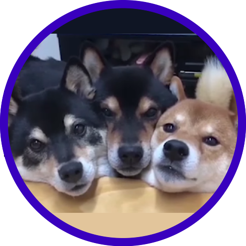

# Dogolins Bot *for Discord*

 \
*Dogolins in action*

## Description

DogolinsIntel **is** a set of dogs each of which, provides information related to
games, music and server updates.\
Each Dogolin takes special care of a different information.\
By now, there's only one Dogolin active, a.k.a. MaxDogolin!\
*Meanwhile on DogolinsIntel HQ* :cry: `MaxDogolin is feeling lonely and 
waiting indefinitely for other Dogolins`

## Wikia
Here's a list of all Dogolins ready to help you :)\
Dogolins planning to come to this pack are not marked on the following list, 
as a friend says: "it's trivial!", but it's always good to be crystal clear!

- [x] MaxDogolin is a special service bot for Spotify :musical_score:*chilling baby*:movie_camera:;
- [ ] MitDogolin will be charged to provide you games information :sunglasses:*Oh Yeah!*:sunglasses:;
- [ ] NetDogolin will be the most hated Dogolin, he's kind of :smiling_imp:**gossipy**;

### MaxDogolin (master of Spotify arts)
He is able to give you a list of Youtube videos of what you're listening on Spotify 
(he also requests heartily to integrate Spotify account with Discord before asking
for help. Without it, Max will not have work to do on your channel. :worried:*Feels bad man*)
This feature comes ready-to-go, so no commands needed, just enjoy
your music and when you want to check Discord, MaxDogolin will have sent
a message for you listing all videos related to that music on YouTube! :)

Be patience, every Dogolin commits errors and we are open for feedback!